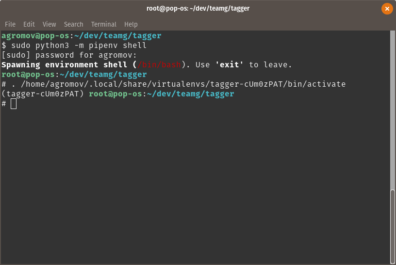

Getting Started
===============

By following the steps on this page, you will get your system ready for running and developing Tagger.

System Requirements
-------------------

Tagger was developed and tested on Ubuntu 16.04 and 18.04. It will likely work on other OSes similar to Ubuntu, like Linux Mint and Pop!_OS, but that's not guaranteed.

Downloading Tagger
------------------

You can download Tagger source code from the Guardian's `GitHub repository <https://github.com/Team-Guardian/tagger>`_. Although you can download the files as a zip file using your browser, it's better to learn how to use ``git`` from the command line because it's the tool that makes version control workflow very easy.

Ubuntu distributions don't include ``git`` out-of-the-box, so first you have to download and install it. From your terminal, run the following command.

.. code-block:: bash

    sudo apt-get install git

If you're confused with what is happening and you're just starting to use Ubuntu, take a pause and go through this great `command line tutorial <https://www.learnenough.com/command-line-tutorial>`_ before continuing.

After you install Git, use it to download Tagger with this command.

.. code-block:: bash

    git clone https://github.com/Team-Guardian/tagger.git

If Tagger was downloaded successfully, there will now be a folder called ``tagger`` in your current directory (hint: use ``pwd`` to get the full path of the directory you're in and ``ls`` to list the files and folders that are in it). You will need to be inside the ``tagger`` folder to complete the remaining steps in this guide.

.. code-block:: bash

    cd tagger

Also, when you download a project from GitHub, by default it shows the files on the master branch (Confused? Here's another great `tutorial <https://www.learnenough.com/git-tutorial>`_ that explains Git). Change to the ``development`` branch before continuing.

.. code-block:: bash

    git checkout development
    git pull

Collecting Dependencies
-----------------------

Tagger uses `Pipenv <https://docs.pipenv.org/>`_ to manage Python package dependencies. Being a tool inspired by package managers from other languages, Pipenv has an additional benefit of automatically creating and managing a virtual environment for your project to keep package dependencies isolated - you can read more about the tool in the :doc:`guide for developers <./for_developers>`.

Another set of dependencies that must be installed is system packages. Included in the repository is an installation script, ``install.sh``, that takes care of both the system-wide and Python dependencies. Simply run the script to finish collecting dependencies for Tagger.

.. code-block:: bash

    sudo sh install.sh

Output of the script is written to the log file, ``.install.log``.

Setup PostgreSQL
----------------

PostgreSQL is a database management software that Tagger uses to organize its data about flights, images, targets, etc. Before running Tagger, we have to create a local instance of the database (Confused? There's no tutorial this time - it's a difficult topic, but you don't really need to know it to work with Tagger).

Start by logging in as a ``postgres`` user.

.. code-block:: bash

    sudo -i -u postgres

Next, launch the PostgreSQL terminal interface, ``psql``.

.. code-block:: bash

    psql

Your terminal prompt should be changing after running each of these two commands, maybe it will even change color - if none of that is happening, make sure you didn't glance over an error in one of the above steps. You can start over by closing the terminal, opening a new one and navigating back to the ``tagger`` folder. 

After you launch ``psql``, change the default ``postgres`` user password to ``postgres`` (note: commands in ``psql`` are prepended with ``\`` and to change the password you will be prompted to enter it twice; remember, you won't see the password you're typing).

.. code-block:: bash

    \password
    postgres
    postgres

After you change the password, create a database called ``tagger`` owned by the user ``postgres``.

.. code-block:: bash

    create database tagger with owner postgres;
    \q

Change the user from ``postgres`` back to "yourself".

.. code-block:: bash

    exit

Finally, restart the PostgreSQL service.

.. code-block:: bash

    sudo service postgresql restart

Running Tagger
--------------

Because Pipenv installed dependencies in a virtual environment that it has created, to run Tagger you would first need to activate the virtual environment. To do that, start a Pipenv "shell".

.. code-block:: bash

    sudo python3 -m pipenv shell

If the virtual environment is activated successfully, you should see the terminal prompt prepended with the name of the virtual environment.

In the last section, we created an empty database. Now we need to tell it how we want it to look like (in other words, what kind of data we want to store in and how it should be organized). You don't have to start from scratch - Tagger already comes with a schema and all that's left is to apply it.

.. code-block:: bash

    python3 manage.py migrate

You should now be able to launch the Tagger GUI with the following command.

.. code-block:: bash

    python3 main.py